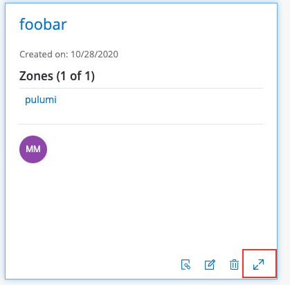
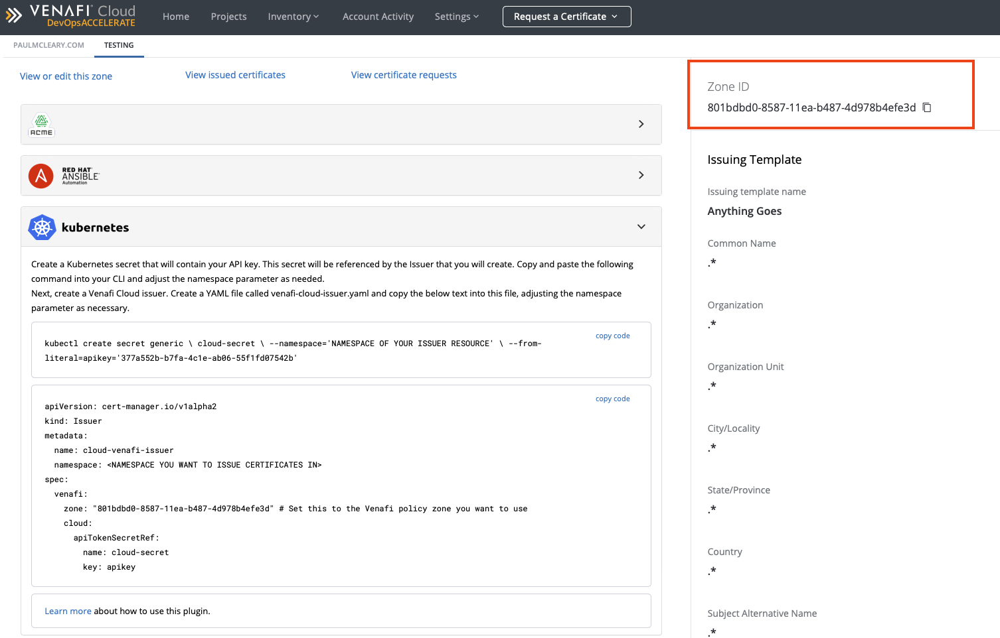

# Securing Ingress with Venafi Cloud

Deploys a Kubernetes cluster on AWS EKS, installs the cert-manager, and deploys
an example app with an NGINX ingress controller configured to use a newly
issued TLS certificate.

## Requirements

1. [Get Started with Pulumi](https://www.pulumi.com/docs/get-started/kubernetes/)
1. [Get Started with Pulumi and Kubernetes](https://www.pulumi.com/docs/get-started/kubernetes/)
1. Create an account with [Venafi Cloud](https://ui.venafi.cloud/login)
  1. Create a new project, along with a new zone if you don't have one already.
  1. With a project and zone created, expand the details of the project to get
     the Zone GUID which will be used in the configuration below.
     
     

## Initialize the Pulumi Project

1.  Change into the project directory.

    ```bash
	cd examples/venafi-cloud
    ```

1.  Install the dependencies.

    ```bash
    npm install
    ```

1.  Create a new Pulumi [stack][stack] named `dev`.

    ```bash
    pulumi stack init dev
    ```

1. Set the Pulumi [configuration][pulumi-config] variables for the project.

    > **Note:** Select any valid Kubernetes regions for the providers.

    ```bash
    pulumi config set aws:region us-west-2
    pulumi config set r53HostedZoneName <YOUR-R53-HOSTED-ZONE-NAME> // e.g. pulumi-demos.net
    pulumi config set venafiCloudApiUrl <YOUR-VENAFI-CLOUD-URL>    // e.g. https://api.venafi.cloud/v1
    pulumi config set venafiCloudZone <YOUR-VENAFI-CLOUD-ZONE>  // e.g. The GUID of the zone: 20c72172-175b-12ec-a6f6-f92327dc4cbd
    pulumi config set --secret venafiCloudApiKey <YOUR-VENAFI-CLOUD-API-KEY>
    ```

## Deploy the Stack

Create the cluster and deploy the workloads by running an update.

### Run an update

```bash
pulumi up -y
```

The update takes 15-20 minutes.

### Run an update with Policy Pack Enforcement

```bash
pulumi up -y --policy-pack policy/
```

The update takes 15-20 minutes and will enforce that the any cert-manager
Issuer or ClusterIssuers are of type `acme` or `venafi`.

### Verify the cluster is running

Using the `kubeconfig` stack output, we can verify the cluster and Pods are up
and running:

```bash
pulumi stack output kubeconfig > kubeconfig.json
export KUBECONFIG=`pwd`/kubeconfig.json

kubectl get nodes -o wide --show-labels
kubectl get pods --all-namespaces -o wide --show-labels
```

### Wait for the certificate to be issued

Wait for the certificate to be created by the cert-manager.

This can take 2-5 minutes.

```bash
kubectl get certificate -n cert-manager
```

### Wait for the ingress to be ready

Wait for the ingress to be ready

This can take a few minutes.

Once it's available you'll see output like the following and you can then visit
the host URL.

```bash
kubectl get ing -n cert-manager

NAME             HOSTS                       ADDRESS                                                                 PORTS     AGE
kuard-s328731t   kuard-venafi-cloud.pulumi-demos.net   a2d535193d1fa4321a3455d63b12fe8f-56180337.us-west-2.elb.amazonaws.com   80, 443   2m22s
```

Visit `kuard-venafi-cloud.pulumi-demos.net` or similar depending on your hosted zone used.

## Clean Up

Run the following command to tear down the resources that are part of our
stack.

1. Run `pulumi destroy` to tear down all resources.  You'll be prompted to make
   sure you really want to delete these resources.

   ```bash
   pulumi destroy
   ```

1. To delete the stack, run the following command.

   ```bash
   pulumi stack rm
   ```
   > **Note:** This command deletes all deployment history from the Pulumi
   > Console and cannot be undone.

[stack]: https://www.pulumi.com/docs/reference/stack.md"
[pulumi-config]: https://www.pulumi.com/docs/reference/config"
